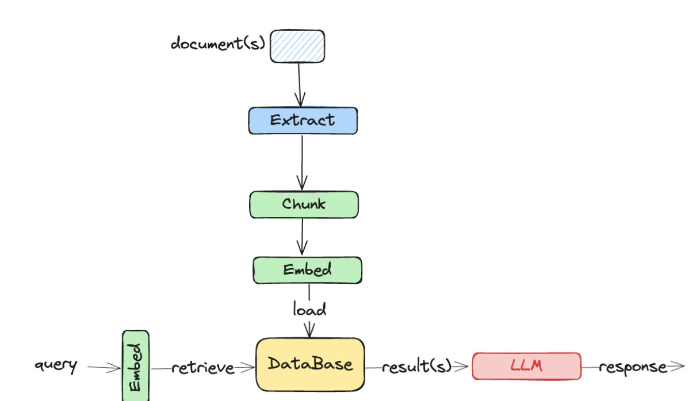

## LangChain Tutorial from Deeplearning.ai

### Retrieval Augmented Generation (RAG)



- Extract: Documents come in all sorts of file formats (.doc, .pdf, etc.) and contain all sorts of data formats (text, tables, images, movies). These must be extracted and put into a format that can be processed by the next stages.
- Chunking: Text data is broken into smaller chunks – a process inventively named ‘chunking’.
- Embedding:  Converting a chunk into a ‘dense vector’ that represents the meaning of the text.
- Loading: Adding the embedding and original data to a database.
- Database
	- The database is going to provide storage for the embedding and data. Often these are vector databases due to the embedding, but graph databases and traditional databases are also used.
- Query
	- Embedding: The query is converted to a dense vector using the same embedding model.
	- Retrieval: The stored and query vectors represent meaning, so retrieval is the process of finding the k entries in the database that are ‘closest’ to the query vector. Lots of details here!
	- k results are provided to an LLM which uses them to form an ‘augmented’  response.


### LLM 

[Ollama](https://ollama.com/)

[Ollama Models](https://ollama.com/library)

[Ollama Github](https://github.com/ollama/ollama)

```
Download Ollama

> ollama run llama3
> ollama pull nomic-embed-text
```


## [LangChain Chat with Your Data](https://learn.deeplearning.ai/courses/langchain-chat-with-your-data)


- Document Loading
- Document Splitting
- Vectorestores and Embedding
- Retrieval 
- Question Answering
- Chat


## [LangChain for LLM Application Development](https://learn.deeplearning.ai/courses/langchain/lesson/1/introduction)

### LangChain: Memory 
- ConversationBufferMemory
- ConversationBufferWindowMemory
- ConversationTokenBufferMemory
- ConversationSummaryMemory

### LangChain: Chains 
- LLMChain
- Sequential Chains
	- SimpleSequentialChain
	- SequentialChain
- Router Chain

### LangChain: Evaluation 
- Example generation
- Manual evaluation (and debuging)
- LLM-assisted evaluation
- LangChain evaluation platform
